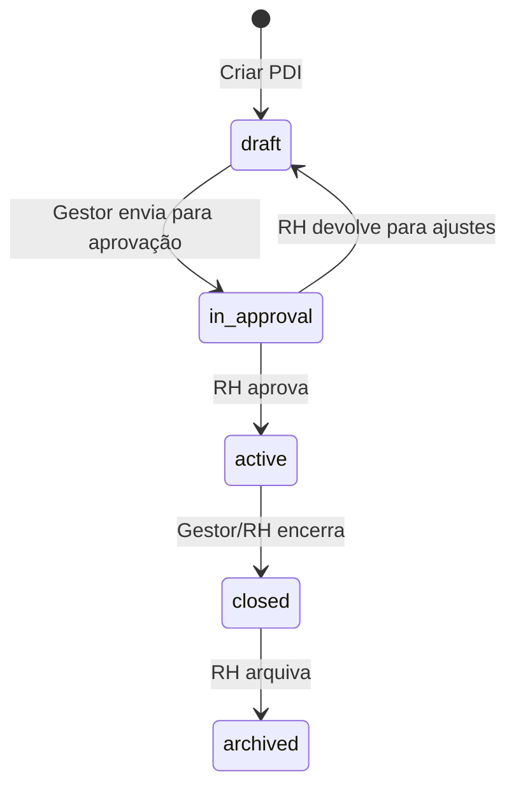

# PDI — Fluxo e Casos de Teste

## 1. Visão geral

O **PDI (Plano de Desenvolvimento Individual)** permite criar, aprovar, acompanhar e encerrar planos de desenvolvimento por colaborador. Envolve:

- **Criação** por RH ou gestor (gestor só para subordinados).
- **Ciclo de vida**: Rascunho → Em aprovação → Ativo → Concluído → (opcional) Arquivado.
- **Objetivos e planos de ação** (curso ou prática), com progresso e status.
- **Check-ins** durante o PDI ativo e comentário do colaborador no último check-in.
- **Diagnóstico** opcional a partir de Avaliação ou DISC vinculados.

---

## 2. Fluxo do PDI

### 2.1 Diagrama de estados

### 2.2 Transições e responsáveis

| Status atual   | Ação                    | Quem pode        | Novo status   |
|----------------|-------------------------|------------------|---------------|
| Rascunho      | Enviar para aprovação   | Gestor / RH      | Em aprovação  |
| Em aprovação  | Aprovar                 | RH               | Ativo         |
| Em aprovação  | Devolver para ajustes   | RH               | Rascunho      |
| Ativo         | Encerrar PDI            | Gestor / RH      | Concluído     |
| Concluído     | Arquivar PDI            | RH               | Arquivado     |

### 2.3 Fluxo de uso resumido

1. **RH ou Gestor** cria o PDI (colaborador, período, origem, opcional: avaliação/DISC).
2. **Gestor/RH** preenche objetivos e planos de ação (ou gera via diagnóstico, se houver avaliação/DISC).
3. **Gestor** envia para aprovação → status "Em aprovação".
4. **RH** aprova → "Ativo" ou devolve → "Rascunho".
5. Com PDI **Ativo**: **Gestor/RH** registra check-ins; **Colaborador** pode comentar no último check-in.
6. **Gestor/RH** encerra o PDI (resultado + comentário) → "Concluído".
7. **RH** pode arquivar → "Arquivado".

---

## 3. Permissões

| Ação                         | Colaborador | Gestor (subordinado) | RH   |
|-----------------------------|-------------|----------------------|------|
| Ver lista de PDIs           | Só os próprios | Próprios + equipe  | Todos do tenant |
| Criar PDI                   | Não         | Sim (equipe)         | Sim  |
| Ver detalhe do PDI          | Só próprio  | Equipe               | Todos |
| Editar objetivos/ações      | Não         | Sim                  | Sim  |
| Enviar para aprovação       | Não         | Sim                  | Sim  |
| Aprovar / Devolver          | Não         | Não                  | Sim  |
| Registrar/editar check-in   | Não         | Sim                  | Sim  |
| Comentar no check-in        | Sim (próprio, último) | Não | Não  |
| Encerrar PDI                | Não         | Sim                  | Sim  |
| Arquivar PDI                | Não         | Não                  | Sim  |

---

## 4. Casos de teste

### 4.1 Lista de PDIs (`/pdis`)

| ID  | Cenário                          | Pré-condição              | Passos                                      | Resultado esperado                    |
|-----|----------------------------------|---------------------------|---------------------------------------------|----------------------------------------|
| L01 | RH acessa lista                  | Usuário role `hr`         | Login → Menu PDI                             | Ver todos os PDIs do tenant; botão "Novo PDI"; filtros Colaborador e Status |
| L02 | Gestor acessa lista              | Usuário role `manager`    | Login → Menu PDI                             | Ver PDIs próprios e da equipe; "Novo PDI"; filtro Colaborador (só subordinados) |
| L03 | Colaborador acessa lista         | Usuário role `employee`   | Login → Menu PDI                             | Ver só PDIs em que é o colaborador; sem "Novo PDI"; filtro status inicia em "Ativo" |
| L04 | Filtro por status                | Lista com PDIs            | Selecionar status (ex.: Ativo)               | Lista mostra apenas PDIs com esse status |
| L05 | Filtro por colaborador           | RH ou gestor              | Buscar e selecionar colaborador              | Lista mostra apenas PDIs daquele colaborador |
| L06 | Paginação                       | Total > tamanho da página | Trocar página e "Por página" (10/25/50)      | Página e total atualizam corretamente  |
| L07 | Sem PDIs                         | Nenhum PDI para o usuário | Acessar /pdis                               | Mensagem "Nenhum PDI encontrado"       |
| L08 | Link para detalhe                | Lista com pelo menos 1 PDI| Clicar em "Ver" ou "Editar"                  | Navega para `/pdis/:pdiId`             |

---

### 4.2 Criação de PDI (modal "Novo PDI")

| ID  | Cenário                          | Pré-condição        | Passos                                      | Resultado esperado                    |
|-----|----------------------------------|---------------------|---------------------------------------------|----------------------------------------|
| C01 | Criar PDI mínimo                 | RH ou gestor        | Colaborador, data ini/fim, origem → Criar   | PDI criado em Rascunho; redireciona para detalhe |
| C02 | Validação datas                  | Modal aberto        | Data inicial > data final → Criar           | Toast erro; PDI não criado             |
| C03 | Validação obrigatórios           | Modal aberto        | Deixar colaborador ou datas em branco → Criar | Toast "Preencha colaborador e período" |
| C04 | Origem Avaliação + vínculo       | Colaborador com avaliação submetida | Origem "Avaliação", selecionar avaliação, Criar | PDI com `evaluation_id`; seção Diagnóstico disponível |
| C05 | Origem DISC + vínculo            | Colaborador com DISC completo | Origem "DISC", selecionar assessment, Criar | PDI com `behavioral_assessment_id`; Diagnóstico DISC disponível |
| C06 | Gestor só vê subordinados        | Role manager        | Abrir modal e buscar colaborador            | Lista só perfis com `manager_id` = gestor |
| C07 | Cancelar criação                 | Modal aberto        | Preencher campos → Cancelar                  | Modal fecha; nenhum PDI criado         |

---

### 4.3 Detalhe do PDI e objetivos

| ID  | Cenário                          | Pré-condição              | Passos                                      | Resultado esperado                    |
|-----|----------------------------------|---------------------------|---------------------------------------------|----------------------------------------|
| D01 | Cabeçalho e progresso            | PDI existente             | Abrir detalhe com objetivos/ações           | Nome do colaborador, período, status; barra de progresso correta |
| D02 | Adicionar objetivo               | PDI rascunho/em aprovação/ativo; canManage | Objetivos → Adicionar objetivo (descrição, prioridade, data) | Objetivo na lista; progresso atualizado se houver ações |
| D03 | Editar objetivo                  | Objetivo existente        | Editar descrição/prioridade/data            | Alterações salvas                    |
| D04 | Excluir objetivo                 | Objetivo existente        | Excluir objetivo                            | Objetivo removido; ações do objetivo também |
| D05 | Adicionar ação (curso/prática)   | Objetivo existente        | Adicionar ação, tipo, responsável, data     | Ação listada no objetivo             |
| D06 | Alterar status da ação           | Ação existente            | Mudar status (Pendente → Em andamento → Concluída) | Status salvo; progresso no topo atualiza |
| D07 | Colaborador não edita            | Role employee; PDI próprio | Abrir detalhe                              | Sem botões de adicionar/editar/excluir objetivos e ações |

---

### 4.4 Diagnóstico (objetivos a partir de avaliação/DISC)

| ID  | Cenário                          | Pré-condição                    | Passos                                      | Resultado esperado                    |
|-----|----------------------------------|---------------------------------|---------------------------------------------|----------------------------------------|
| DG01| Diagnóstico por avaliação        | PDI com evaluation_id; canManage | Abrir PDI → seção Diagnóstico               | Competências com nota ≤ 3 listadas    |
| DG02| Criar objetivos por competência   | Competências de baixa nota      | Marcar competências → Criar objetivos       | Objetivos criados; seção Objetivos atualizada |
| DG03| Diagnóstico por DISC             | PDI com behavioral_assessment_id | Abrir PDI → seção Diagnóstico              | Pontos de atenção do perfil DISC      |
| DG04| Sem vínculo                      | PDI sem avaliação/DISC         | Abrir PDI                                   | Seção Diagnóstico não exibida         |

---

### 4.5 Envio para aprovação e aprovação

| ID  | Cenário                          | Pré-condição        | Passos                                      | Resultado esperado                    |
|-----|----------------------------------|---------------------|---------------------------------------------|----------------------------------------|
| A01 | Enviar para aprovação            | PDI Rascunho; gestor/RH | Clicar "Enviar para aprovação"             | Status → Em aprovação; bloco some     |
| A02 | RH aprova                       | PDI Em aprovação; RH | Aprovar PDI                                 | Status → Ativo; toast sucesso         |
| A03 | RH devolve                      | PDI Em aprovação; RH | Devolver para ajustes                      | Status → Rascunho; gestor pode editar e reenviar |
| A04 | Gestor não aprova               | PDI Em aprovação; manager | Abrir detalhe                             | Seção de aprovação não aparece (só RH) |
| A05 | Colaborador não envia            | PDI Rascunho; employee | Abrir detalhe                             | Botão "Enviar para aprovação" não aparece |

---

### 4.6 Check-ins (PDI ativo)

| ID  | Cenário                          | Pré-condição              | Passos                                      | Resultado esperado                    |
|-----|----------------------------------|---------------------------|---------------------------------------------|----------------------------------------|
| CH01| Gestor adiciona check-in         | PDI Ativo; gestor         | Check-ins → Adicionar (data, status, comentário) | Check-in na lista                     |
| CH02| Editar check-in                  | Check-in existente; canManage | Editar data/status/comentário gestor       | Alterações salvas                     |
| CH03| Colaborador comenta              | PDI Ativo; colaborador é o employee; último check-in sem comentário | Preencher comentário do colaborador e salvar | Comentário gravado; não pode comentar de novo no mesmo check-in |
| CH04| Check-in desabilitado se não ativo | PDI Rascunho/Em aprovação/Concluído | Abrir detalhe                         | Não é possível adicionar check-in (ou botão desabilitado) |
| CH05| Colaborador não adiciona check-in | PDI Ativo; employee       | Abrir detalhe                              | Sem botão de adicionar check-in       |

---

### 4.7 Encerramento e arquivamento

| ID  | Cenário                          | Pré-condição        | Passos                                      | Resultado esperado                    |
|-----|----------------------------------|---------------------|---------------------------------------------|----------------------------------------|
| E01 | Encerrar PDI                     | PDI Ativo; gestor/RH | Encerrar PDI → Resultado + comentário → Encerrar | Status → Concluído; closed_at e result preenchidos |
| E02 | Resultado e comentário           | Modal encerrar      | Escolher Concluído/Parcial/Não concluído e comentário | Dados salvos no PDI                  |
| E03 | RH arquiva                      | PDI Concluído; RH   | Arquivar PDI                                 | Status → Arquivado                   |
| E04 | Gestor não arquiva              | PDI Concluído; manager | Abrir detalhe                             | Bloco "Arquivar PDI" não aparece      |
| E05 | Encerrar só quando ativo        | PDI Rascunho        | Abrir detalhe                               | Seção "Encerrar PDI" não aparece      |

---

### 4.8 Navegação e links

| ID  | Cenário                          | Passos                                      | Resultado esperado                    |
|-----|----------------------------------|---------------------------------------------|----------------------------------------|
| N01 | Voltar para lista                | Detalhe → seta/Voltar                       | Navega para `/pdis`                   |
| N02 | Link do colaborador              | Clicar no nome do colaborador no cabeçalho  | Navega para `/employees/:userId`      |
| N03 | Link do colaborador na lista     | Lista → nome do colaborador                 | Navega para perfil do colaborador     |

---

### 4.9 Regras de negócio e validações

| ID  | Cenário                          | Resultado esperado                    |
|-----|----------------------------------|----------------------------------------|
| V01 | Criar PDI com data fim no passado | Permitido (não há validação de "data no futuro" no código atual) |
| V02 | Objetivo sem ações               | Permitido; progresso considera só ações existentes |
| V03 | Ação tipo "curso" com assignment | Se houver integração com curso, conclusão do curso pode atualizar ação (ver migration 046) |
| V04 | Múltiplos check-ins mesma data   | Permitido (não há unicidade por data no código) |
| V05 | PDI arquivado                    | Continua visível na lista com filtro "Arquivado"; não entra em novo fluxo |

---

## 5. Resumo por perfil

- **Colaborador**: ver próprios PDIs, filtrar por status, abrir detalhe, comentar no último check-in (PDI ativo).
- **Gestor**: tudo do colaborador + criar PDI (equipe), editar objetivos/ações, enviar para aprovação, check-ins, encerrar; não aprovar nem arquivar.
- **RH**: visão de todos os PDIs, criar/editar qualquer PDI, aprovar/devolver, check-ins, encerrar e arquivar.

---

## 6. Referência de status (labels)

| Status (código) | Label exibida   |
|-----------------|-----------------|
| draft           | Rascunho        |
| in_approval     | Em aprovação    |
| active          | Ativo           |
| closed          | Concluído       |
| archived        | Arquivado       |
